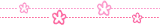
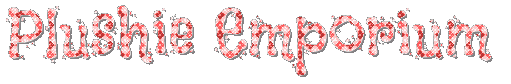

&#8203

  

#

## projeto em grupo de uma loja de pelucias

Peluche Emporium é uma loja online onde você pode encontrar as pelucias mais fofas que existem!  
Site criado para avaliação semesral da faculdade de computação e treino de desenvolvimento web. Inicalmente feito em php porem tivemos problemas com o banco de dados e acabamos não finalizando ele 100%. Pretendo pegar esse projeto pra finalizar ele no futuro.
